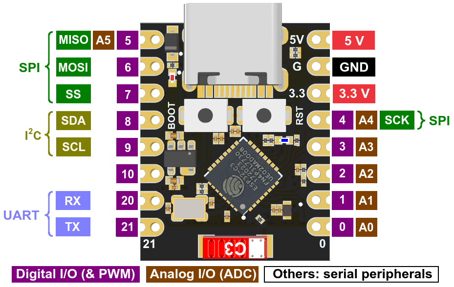

# Nexus Network

<h1 align="center">Nexus Network</h1>

A flexible, ESP32-based automation system for custom control networks.

 

## Overview

Nexus is a comprehensive custom automation system built on ESP32 hardware. At its core, Nexus enables seamless communication between a central Master node and multiple customizable Slave nodes using the ESP-NOW protocol. The system is designed for flexibility, allowing you to create a network of specialized nodes tailored to your specific automation needs.

Each Slave node can be customized to serve different purposes - from environmental monitoring and data collection to controlling lights, motors, or other devices. The modular architecture allows you to define the role and behavior of each node through the intuitive web interface.

The system features a responsive dashboard for monitoring and controlling all connected devices, with real-time updates via WebSockets. Whether you're building a home automation system, an environmental monitoring network, or an industrial control solution, Nexus provides the foundation for your custom automation projects.

Key aspects of the system include:

- **Customizable Slave Nodes**: Configure each node for specific roles and behaviors
- **Flexible Device Roles**: Assign specialized functions to each node in your network
- **Centralized Control**: Manage your entire automation system from a single interface
- **Power Efficiency**: Deep sleep support for battery-powered nodes
- **Expandable Architecture**: Add new nodes and functionality as your needs grow

## Hardware Components

### Master Node

- ESP32-S3 UNO
- Acts as the central hub for all communication
- Hosts the web interface via built-in WiFi access point

### Slave Nodes

- ESP32-C3 Super Mini
- Compact form factor for various applications
- Deep sleep support for power efficiency

## Pinout References

### ESP32-S3 UNO (Prototype Master)

### ESP32-C3 Super Mini (Prototype Slave Nodes)

## Features

- **Real-time Communication**: Instant updates between Master and Slaves using ESP-NOW
- **Power Management**: Configurable deep sleep for Slave nodes to maximize battery life
- **Web Dashboard**: Intuitive interface for monitoring and controlling all nodes
- **GPIO Control**: Remote control of digital and analog pins on Slave nodes
- **Flexible Configuration**: Customizable reporting intervals, sleep duration, and more
- **Queue System**: Ability to remove and restore Slave nodes as needed
- **WebSocket Communication**: Real-time updates without polling

## Project Status

This project is currently in the prototype phase. A PCB design is planned for future development once the codebase is fully established.

## Repository Structure

- **Master/**: Code for the Master node, including web interface
- **Slave/**: Code for the Slave nodes
- **NexusFlutter/**: Mobile app (under development)

## Getting Started

1. Flash the Master.ino sketch to your ESP32 Master device
2. Flash the Slave.ino sketch to your ESP32-C3 Super Mini devices
3. Upload data to the SPIFF
4. Power on the Master and connect to the "Nexus Network" WiFi access point
5. Access the dashboard at the masters IP address

## Future Development

- Custom PCB design
- Mobile application using Flutter
- Extended sensor support
- Mesh networking capabilities
